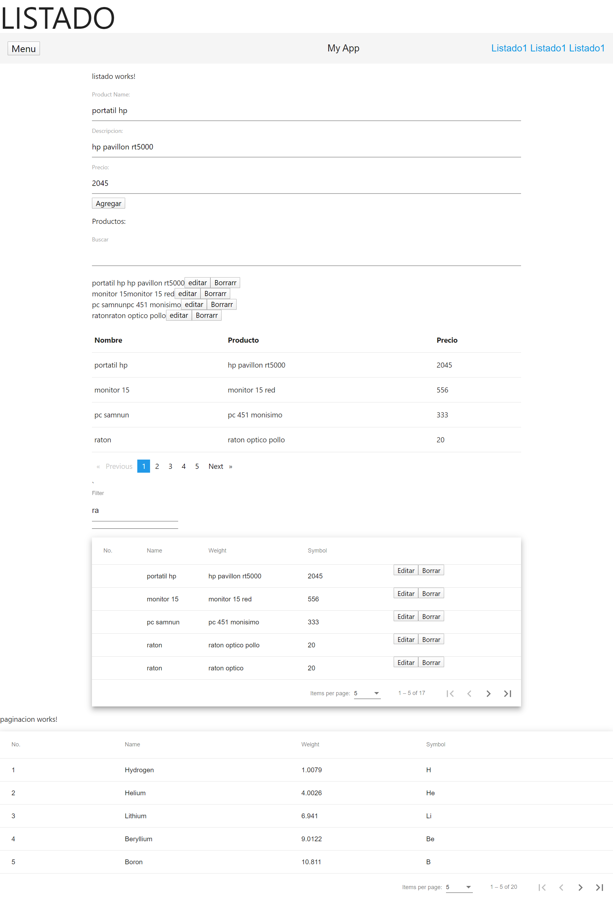

# Angular9-Crud


"# Angular9-pagination-search" 
"# Angular-9--search-pagination" 
## Search Filter Pipe - Busqueda para Angular 8/9
* https://www.npmjs.com/package/ng2-search-filter
* https://github.com/solodynamo/ng2-search-filter#readme
### Install
npm i ng2-search-filter --save
yarn add ng2-search-filter 
### Usage
In case you're using systemjs - see configuration here.

Import Ng2SearchPipeModule to your module
```
import { NgModule } from '@angular/core';
import { BrowserModule  } from '@angular/platform-browser';
import { AppComponent } from './app';
 
import { Ng2SearchPipeModule } from 'ng2-search-filter';
 
@NgModule({
  imports: [BrowserModule, Ng2SearchPipeModule],
  declarations: [AppComponent],
  bootstrap: [AppComponent]
})
export class AppModule {}
```
And use pipe in your component
```
import { Component } from '@angular/core';
 
@Component({
  selector: 'example-app',
  template: `
    <div>
        <input type="text" [(ngModel)]="term">
        <div *ngFor = "let item of items |filter:term" >
          <p>
            {{item.name}}
          </p>
        </div>
 
    </div>  
  `
})
 
export class AppComponent {
  items: string[] = [{ name: "archie" }, { name: "jake" }, { name: "richard" }];
}
```
Support ng2-search-filter
## ngx-pagination -Pagination for Angular
* https://www.npmjs.com/package/ngx-pagination
* https://github.com/michaelbromley/ngx-pagination#readme
### Simple Example
```
// app.module.ts
import {NgModule} from '@angular/core';
import {BrowserModule} from '@angular/platform-browser';
import {NgxPaginationModule} from 'ngx-pagination'; // <-- import the module
import {MyComponent} from './my.component';
 
@NgModule({
    imports: [BrowserModule, NgxPaginationModule], // <-- include it in your app module
    declarations: [MyComponent],
    bootstrap: [MyComponent]
})
export class MyAppModule {}
```
*****************
```
// my.component.ts
import {Component} from '@angular/core';
 
@Component({
    selector: 'my-component',
    template: `
    <ul>
      <li *ngFor="let item of collection | paginate: { itemsPerPage: 10, currentPage: p }"> ... </li>
    </ul>
               
    <pagination-controls (pageChange)="p = $event"></pagination-controls>
    `
})
export class MyComponent {
    p: number = 1;
    collection: any[] = someArrayOfThings;  
}
```
### API
PaginatePipe
The PaginatePipe should be placed at the end of an NgFor expression. It accepts a single argument, an object conforming to the PaginationInstance interface. The following config options are available:
```
<some-element *ngFor="let item of collection | paginate: { id: 'foo',
                                                      itemsPerPage: pageSize,
                                                      currentPage: p,
                                                      totalItems: total }">...</some-element>
 ```
* itemsPerPage [number] - required The number of items to display on each page.
* currentPage [number] - required The current (active) page number.
* id [string] If you need to support more than one instance of pagination at a time, set the id and ensure it matches the id attribute of the PaginationControlsComponent / PaginationControlsDirective (see below).
* totalItems [number] The total number of items in the collection. Only useful when doing server-side paging, where the collection size is limited to a single page returned by the server API. For in-memory paging, this property should not be set, as it will be automatically set to the value of collection.length.
